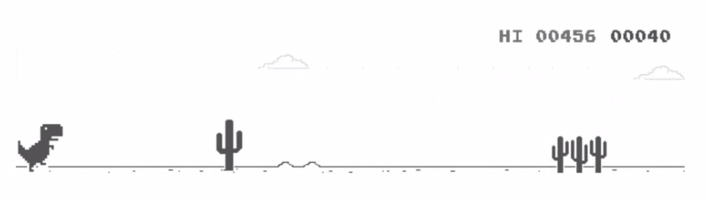

<h1 align=center>💻 Mechanical Player Dino Game</h1>
<p align="center">
  
</p>

## About

The goal of this project is to create a robot that can play the Dino game (on Chrome when there is no internet connection).

## Features
- **Description**: Use an Arduino board to automate gameplay of the Dino game on a PC by manipulating hardware registers.
- **Feature**:
	- Detect changes in light caused by obstacles to trigger the space bar.
	- Simulate key presses using a servo motor and a photoresistor.
- **How to Use**: Assemble the circuit using the provided schematic and upload the code to the Arduino board.

## Setup
### **Clone the Repository**:
```bash
git clone https://github.com/J0hann3/EmbeddedProject;
cd EmbeddedProject/Mechanical_Player_Dino_Game
```

### **Components Needed**:
- UNO R3 Controller Board(ATmega328)
- Server Motor
- Photoresistor(Photocell)
- USB cable
- 10k Resistor
- Breadboard
- Wires
- Scotch Tape

[Link to the kit Elegoo - The most complete starter kit](https://eu.elegoo.com/fr/products/elegoo-mega-2560-the-most-complete-starter-kit?utm_source=officialhome&utm_medium=referral&utm_id=eustorefr)

### Circuit Assembly

1. **Construct the circuit following the schematic**:


2. **Attach Components**:

	- Place the photoresistor on the screen where the cactus passes, and secure it with scotch tape.
	- Position the servo motor over the space bar and fix it with scotch tape.

3. **Configure Script Parameters**:

	- Adjust the pressure applied to the space bar by the servo motor in the code.
	- Set the sensitivity threshold for the photoresistor in the code in the code.

## Usage
1. Compile and upload the code to the Arduino board:
	```bash
	make
	```
2. Open the Chrome Dino game and watch the board play automatically!
	- By typing `chrome://dino` in Chrome searching bar

## New Notion

### Photoresistor

A photoresistor is a light-sensitive resistor whose resistance decreases or increases depending on the intensity of light.

- **Principle**: When the light intensity increases, the resistance decreases.
- **Application in this Project**: The photoresistor detects changes in light when a cactus appears, triggering the Dino to jump.
- **Implementation**: Using an analog pin on the Arduino, the light readings are processed to determine when to activate the servo motor.

### Servo Motor
A servo motor is a device that converts a control signal into a mechanical motion.

- **Principle**: The motor's position is adjusted based on the input signal, controlled by a duty cycle.
- **Application in this Project**: The servo motor presses the space bar when the photoresistor detects a cactus.
- **Implementation**: The signal from the photoresistor is converted into an appropriate pulse width to position the servo motor.

## Demo
### Final Result
- Watch the Dino game being played autonomously:


### Construction and components
- **Photoresistor**: Placed on the screen to detect obstacles.


- **Servo Motor**: Positioned on the space bar to simulate key presses.


- **Board**: Connected to the photoresistor and the servo motor to process inputs and outputs.

